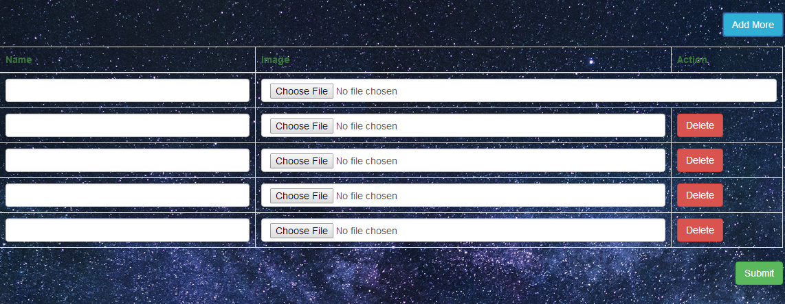

# Dynamically add or remove input fields using Jquery laravel




```
YouTube => https://youtu.be/v_xsWR_7hpE
```

## Project Clone
```
1)git clone https://github.com/vermaboys/dynamically-add-or-remove-input-fields-using-Jquery-laravel.git
2)cp .env.example .env

	*****.env File****
	DB_CONNECTION=mysql
	DB_HOST=127.0.0.1
	DB_PORT=3306
	DB_DATABASE=here your database name
	DB_USERNAME=here database username
	DB_PASSWORD=here database password

3)php artisan key:generate
4)composer install
5)php artisan migrate
6)php artisan db:seed
7)E-Mail Address:- demo@gmail.com, Password:- 123456
````
